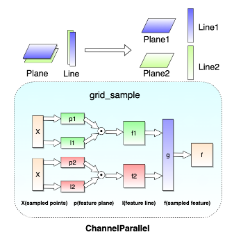
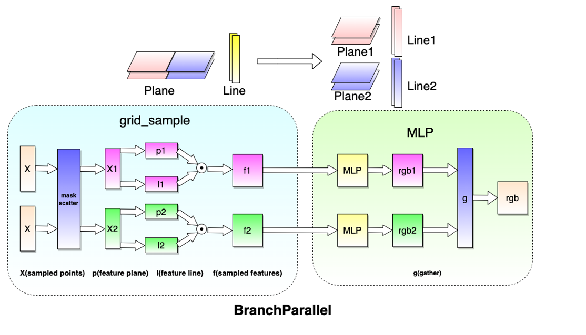
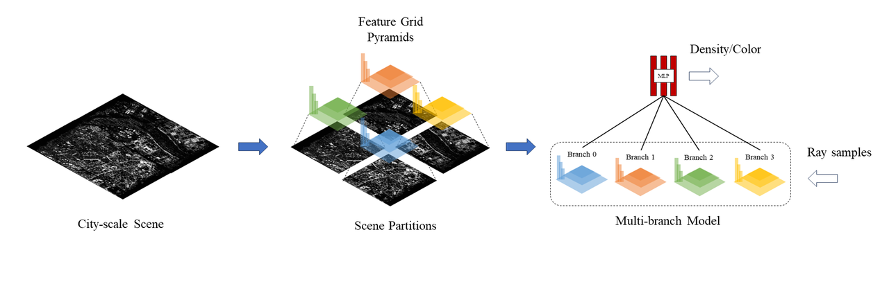

# 并行策略

本节将对LandmarkSystem中已支持的各项并行策略的实现原理及使用方法进行介绍，涵盖`data parallel`、`channel parallel`以及`branch parallel`等并行方法。

## Data Parallel

训练中的`data parallel`基于`torch.nn.parallel.DistributedDataParallel`实现，通过将实例化好的模型进行wrap包装，自动地在训练过程中进行梯度的`AllReduce`同步。此时每个并行rank上的模型输入将由完整ray batch转变为互不相交的ray batch切片。

渲染中的`data parallel`则不需要将实例化好的模型进行wrap，所有并行rank上维护相同的模型副本，同样以ray batch切片作为各自模型的输入。因此，`data parallel`对于NeRF算法而言，实质上形成了`ray Parallel`，即以采样光线为粒度的数据并行计算。

目前系统中支持`data parallel`的算法如下

- GridNeRF
- instant-NGP
- Nerfacto

通过设置`TrainConfig`中的配置参数`DDP=True`以在训练中使用`data parallel`，并通过设置训练环境的world size间接地指定并行度，即对ray batch的切片数

## Channel Parallel

`channel parallel`支持用于训练及渲染，基于对模型的特征channel进行拆分实现，每个并行rank上维护着模型的部分特征channel，并共享相同的输入。随着并行度的增加，此时子模型的参数量将线性降低。

以GridNeRF为例，`channel parallel`的实现采取了对特征网格feature grid上各元素沿着特征channel的拆分，feature grid进行VM分解后，则对应了feature plane的拆分和feature line的复制，如下图所示

此时采样点的完整feature依赖于由同一输入在不同channel的子模型上进行采样及结果合并

目前系统中支持`channel parallel`的算法如下

- GridNeRF

通过设置`TrainConfig`中的配置参数`channel_parallel=True`以在训练中使用`channel parallel`，并通过设置`channel_parallel_size=2`以指定并行度，即沿着特征channel的拆分数。

## Branch Parallel

`branch parallel`仅支持用于训练，基于对沿着场景XY平面对模型所有特征进行拆分实现。每个并行rank上维护着模型的部分区域特征，光线上的采样点需要根据其XY投影坐标分配到相应子模型上进行feature计算。随着并行度的增加，此时子模型的参数量将线性降低。

以GridNeRF为例，`branch parallel`的实现采取了对特征网格feature grid上各元素沿着场景XY平面的拆分，feature grid进行VM分解后，则对应了feature plane的拆分和feature line的拆分，如下图所示

此时同一光线上各个采样点需要在其所属branch子模型中计算出feature，并通过同一MLP以得到采样点的密度与颜色，最终在计算光线对应RGB值时进行合并

共享MLP的优势是使得分布于不同branch上的feature在经过MLP解算为密度与颜色时能够确保连续一致性，消弭不同branch之间尤其是连接处的视觉差异

目前系统中支持`branch parallel`的算法如下

- GridNeRF
- instant-NGP
- Nerfacto

通过设置`TrainConfig`中的配置参数`branch_parallel=True`以在训练中使用`branch parallel`，并通过设置`plane_division=[4, 4]`以指定并行度，即特征平面沿着XY平面上的拆分数
